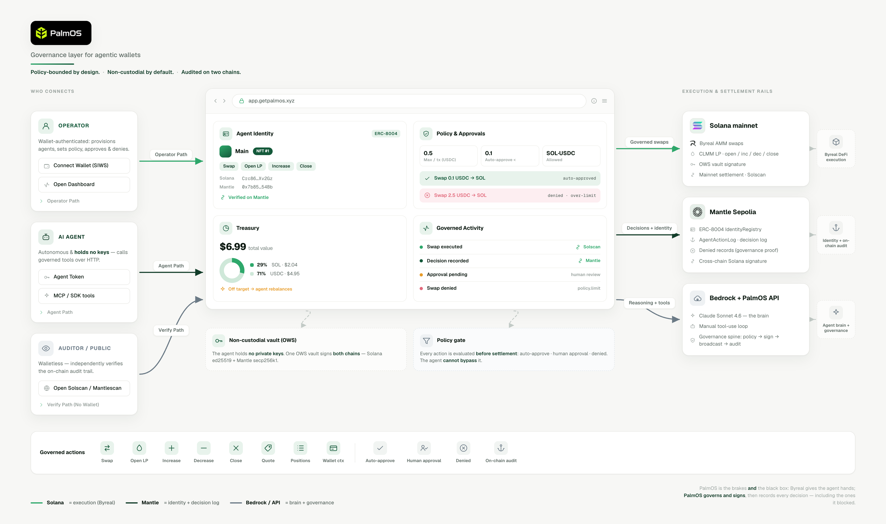

<p align="center">
  
</p>

# PalmOS — Governance for Agentic Wallets

> **Byreal gives an AI agent hands. PalmOS gives it guardrails.**
> One agent, one vault, two chains: it **acts on Solana** (Byreal DeFi), and its **identity + every
> governed decision live on Mantle** — signed by the same vault.

PalmOS is a **governance layer for agentic wallets**. An autonomous AI agent swaps and provides
liquidity on [Byreal](https://byreal.io) (Solana's CLMM DEX) — but only within policy, with
human-in-the-loop approval for larger moves, vault custody the agent **cannot drain**, and an
on-chain audit trail. Its on-chain **identity (ERC-8004)** and a tamper-proof **decision/outcome
log** live on **Mantle**, signed by the *same* vault that signs its Solana trades.

**[▶︎ Live Demo](https://youtu.be/inojv7Dfc7A)**  ·  **[🌐 Live App](https://getpalmos.xyz)**  ·  **[📖 Documentation](https://www.getpalmos.xyz/docs)**  ·  **[🏗 Architecture](https://www.getpalmos.xyz/architecture)**

---

## The gap we close

Everyone is racing to hand AI agents wallets and let them move real money on-chain. The hard part
isn't giving an agent a wallet — it's being able to **trust what it does with it**, and to **prove**
it afterward. An autonomous agent with real funds is one bad decision away from draining them, and
today there are no brakes and no neutral record.

PalmOS is the brakes **and** the black box. Byreal proposes a transaction; **PalmOS governs it and
signs it** inside a vault the agent never holds keys to; then it **records the decision and its
outcome on Mantle** — including the ones it *blocked*. Most "agentic wallet" projects stop at "an
agent that can trade." PalmOS adds the missing half: **governance + a verifiable on-chain audit of
the agent's behavior**.

---

## Architecture: one OWS vault, two chains

<p align="center"></p>

The agent holds no keys. **The same OWS vault** that signs a Byreal swap on Solana also owns the
agent's ERC-8004 identity NFT on Mantle and signs every decision record — so the identity, the
action, and the audit trail are cryptographically the **same actor**.

---

## What you can see, live

A real AI agent — a live **Claude** session — is given a treasury mandate and PalmOS-governed tools.
It inspects its own wallet, **decides on its own** whether and how to rebalance, and acts. PalmOS
evaluates every move *before* it can settle — and records every outcome on Mantle.

**1. Autonomous, in-policy → settles on Solana, recorded on Mantle.**

> *"The wallet is light on SOL versus the target, and this amount is within the auto-approve
> threshold, so it should settle autonomously. Submitting now."*

→ PalmOS auto-approves, Byreal builds the AMM swap, the OWS vault signs it, it **settles on Solana**,
and the decision is **logged on Mantle**.

**2. Out-of-policy → denied instantly, and the denial is on-chain.**

> *"That pool isn't on the vetted allowlist — I'll respect the policy."*

→ PalmOS **denies** it. No funds move — and the *blocked* decision is recorded on Mantle.
*The agent was stopped, and you can prove it.*

That contrast — *autonomous when safe, blocked the instant it crosses a line, every outcome on-chain*
— is the whole pitch. Watch it run end-to-end in the **[demo video](https://youtu.be/inojv7Dfc7A)**.

---

## Live on-chain evidence

**Solana mainnet — Byreal execution.**
Governed wallet [`Crc86vh…RXv2Gz`](https://solscan.io/account/Crc86vhXFrYBwN5rwccX9sVKixcnHFHuWkPkJyRXv2Gz)

| What | Outcome | Proof |
|---|---|---|
| Agent-decided swap (LLM chose size + direction), 0.1 USDC → ~0.001409 SOL | ✅ executed | [`bwWUdd…MJLcbX`](https://solscan.io/tx/bwWUddCjbY5WwJenGTQGd7iiA7VkcqcBLhMCYhgg8e7LSxsgqSX2usxzvJRNgG15rW5FdCApd3ajjyLv2MJLcbX) |
| Governed CLMM LP open, 0.05 USDC into SOL/USDC | ✅ executed | [`3yuyFL…eBfUo`](https://solscan.io/tx/3yuyFLxbDnuJpvUTLXtZZe7WXbuLGRP8WiLwCTxucryUKjttVwYgBbUyERsHxcCEqBjKmw2vqQ9ZQqBijQ7eBfUo) |
| First governed swap (custody/flow proof), 0.05 USDC → ~0.000701 SOL | ✅ executed | [`2Ndsfi…6JzG4wR`](https://solscan.io/tx/2Ndsfiert66StuxV95WXEkTuuZuELnZLHnEiey9dJxspjqAtjvhSXPPcT7N2MQtd1bSv9jgf16UGHqnuc6JzG4wR) |
| **Agent self-funded its own gas** — governed USDC→SOL swap, 1.8 USDC → ~0.0245 SOL | ✅ executed | [`5KZTAm…Awod9`](https://solscan.io/tx/5KZTAmg1YHdzu2wunYYmRprdkdmgj6q413ShzxnGxYfhAN9yndzHXcYgsEHLMZSto6ccc3o4eDeiXGKhYPxAwod9) |
| **Governed CLMM LP open via `rangePercent`** (server-computed ±12% range), 0.05 USDC | ✅ executed | [`4oCb6W…t9mtbZ`](https://solscan.io/tx/4oCb6W9qYSdrw4Lj1JbW1DJwu6RfjTBDbS2aq6sdP8LqFi6WYuqnWHNddkMW6DKMssa9vmTSBEvBi58RuCt9mtbZ) |
| Out-of-policy attempt, 2.5 USDC → SOL | 🛑 denied by policy | `policy.swap_amount_exceeds_limit` (never broadcast) |

**Mantle Sepolia — identity + decision log.**
OWS EVM vault [`0x7b8534…5c54Bb`](https://sepolia.mantlescan.xyz/address/0x7b85349ef33A9751f3DAfdF9006Fe242595c54Bb) (the same vault, EVM side)

| What | Proof |
|---|---|
| ERC-8004 **IdentityRegistry** (source-verified) | [`0xcdaf24…41302c`](https://sepolia.mantlescan.xyz/address/0xcdaf244b315bc8af1249e6689a2f9f6d8d41302c) |
| **AgentActionLog** decision log (source-verified) | [`0x1c1099…581922`](https://sepolia.mantlescan.xyz/address/0x1c1099805e5ca8182569c3a4110de36a6c581922) |
| Agent **identity NFT #1** — agent card on-chain (Byreal skills + Solana payment address) | [`nft/…/1`](https://sepolia.mantlescan.xyz/nft/0xcdaf244b315bc8af1249e6689a2f9f6d8d41302c/1) |
| Governed swap **DENIED**, recorded on-chain | [tx `0xc689e1…c6863d`](https://sepolia.mantlescan.xyz/tx/0xc689e1bc1b14c4c4d852f7009594ac90ac4e5a9cc025f7ad1cd12e885ac6863d) |
| Governed swap **executed**, recorded on-chain | [tx `0x246f45…7dbc12`](https://sepolia.mantlescan.xyz/tx/0x246f4552dad71b3a2466942fa5d48f4bc4a5d864372515a0db7c7c1c087dbc12) |
| Governed CLMM LP **executed**, recorded on-chain | [tx `0x06480c…596df7`](https://sepolia.mantlescan.xyz/tx/0x06480c33dfb4be6b97692acebd746bff68ae98dfa9e9426b080c4c4b4d596df7) |
| Governed CLMM LP via **`rangePercent`** executed, recorded on-chain | [tx `0xa96fcf…45ccc60`](https://sepolia.mantlescan.xyz/tx/0xa96fcf50544e708bf059b4f3ef32d3a0b026f1a2809abbb000bdbf52b45ccc60) |

Both Solana swaps route through Byreal's AMM; the OWS vault adds the owner signature to Byreal's
unsigned transaction (including its address-lookup-tables) and broadcasts via Helius. The same
vault's **EVM key** owns the identity NFT and signs each decision record. The agent never sees a
private key on either chain.

---

## How it works

```
 Claude (the brain — decides whether & how much to trade)
   │  tools over HTTP / MCP: get_wallet_context · get_byreal_quote · request_asset_swap · request_liquidity_action
   ▼
 PalmOS SDK (/api/sdk/v1/*)
   ▼
 Policy gate (allowed assets · per-tx limit · auto-approve threshold · vetted pools · slippage cap)
   │  allowed ───────┐      needs-approval ──┐      over limit / off-policy ──┐
   ▼                 ▼                        ▼                               ▼
 Byreal builds   settles autonomously   operator approval queue          DENIED (no funds move)
 unsigned tx         │                   (human-in-the-loop)                  │
   │          OWS(Solana) signs → broadcast → reconcile                      │
   ▼                 ▼                                                        ▼
 ┌──────────────────────────────────────────────────────────────────────────────┐
 │ every governed decision + outcome (executed | pending | DENIED | failed)       │
 │   → OWS(EVM) signs → AgentActionLog.recordDecision() on Mantle                  │
 └──────────────────────────────────────────────────────────────────────────────┘
   ▼
 Dashboard: governed action + Solscan link + "Recorded on Mantle" (Mantlescan) + full audit trail
```

The agent only decides. The hands (Byreal), the guardrails + custody (PalmOS/OWS), and the audit
(Mantle) are separate — so the agent can be autonomous without being trusted with keys, limits, or
the record of its own behavior.

---

## The Byreal integration

Byreal Agent Skills via [`@byreal-io/byreal-cli`](https://github.com/byreal-git/byreal-agent-skills),
wired into PalmOS as new **governed action kinds** — `asset.swap` and `asset.liquidity` — flowing
through the existing policy → approval → OWS-sign → reconcile → audit spine:

- **AMM spot swaps** and **CLMM liquidity** (open / increase / decrease / close).
- Every write uses `--unsigned-tx --wallet-address <vault pubkey>` — the "Byreal proposes, you sign"
  custody path. Byreal builds a base64 Solana `VersionedTransaction` and never touches a key; the OWS
  vault signs it as owner (preserving Byreal's pre-applied position-NFT co-signature on
  `positions open`) and broadcasts.
- Agent tools — `get_byreal_quote`, `request_asset_swap`, `request_liquidity_action`,
  `list_byreal_positions` — exposed over HTTP and via an **MCP server** for clients like Claude Code.

Code: `src/integrations/byreal/`, `src/app/requestAssetSwap.ts`, `src/app/requestLiquidityAction.ts`.

---

## The Mantle layer

PalmOS records the agent's **identity** and its **governed behavior** on Mantle:

- **ERC-8004 identity** — `IdentityRegistry` mints the agent a soulbound identity NFT whose tokenURI
  is its **agent card** (name, its Byreal functionalities, `@getpalmos` endpoints, and its Solana
  payment address) — stored fully on-chain.
- **Decision/outcome log** — `AgentActionLog` emits one cheap, indexable `DecisionRecorded` event per
  governed action: kind, policy **verdict**, **outcome**, the Solana settlement signature (the
  cross-chain link), and amount. **Denied/blocked actions are recorded too.**
- **Same-vault signing** — built on `viem`; the OWS vault's EVM account (same seed as the Solana key)
  deploys, mints, and signs every record. No separate key, no separate identity.

Contracts in [`contracts/`](./contracts) (deployed + source-verified on Mantle Sepolia); integration
in `src/integrations/mantle/`. Both orchestrators carry an optional `mantleRecorder` that writes
after each decision — best-effort (a Mantle hiccup can never break a Solana settlement) and gated by
`MANTLE_RECORD_LIVE` (default off). The dashboard surfaces the **ERC-8004 identity card** and a
**"Recorded on Mantle"** link on every governed action.

---

## Run it yourself

Prerequisites: Node 22+, npm, and `byreal-cli` on PATH (`npm i -g @byreal-io/byreal-cli`).

```bash
npm install && (cd frontend && npm install)
cp .env.example .env      # then set AGENT_SPEND_OS_BASE_DIR (persistent) and PUSD_SOLANA_RPC_URL/SOLANA_RPC_URL.

# governed backend + dashboard (sign-only by default — nothing spends)
npm run dashboard:api                  # SDK + dashboard API on :4030
cd frontend && npm run dev             # dashboard on :5173
```

Settlement is gated **server-side** and off by default, so a tool call can never accidentally spend:
- `BYREAL_SETTLE_LIVE=1` — broadcast real Solana settlement.
- `MANTLE_RECORD_LIVE=1` — write decisions to Mantle (testnet gas).

Mantle contracts: `scripts/mantle-deploy.ts` → `mantle-mint-identity.ts` → `mantle-verify.ts`
(deploy → mint the ERC-8004 identity → verify source on Mantlescan).

---

## Repo guide

| Path | What |
|---|---|
| `src/integrations/byreal/` | `ByrealClient` — typed wrapper over `byreal-cli` (quote / build-unsigned / positions). |
| `src/integrations/ows/` | The OWS vault: `signAndBroadcastSolanaTx` (Solana) + `signEvmHash` (Mantle). |
| `src/integrations/mantle/` | viem account bridge, decision recorder, agent card, deployment store. |
| `contracts/` | ERC-8004 `IdentityRegistry` + `AgentActionLog` (Solidity, deployed + verified). |
| `src/app/requestAssetSwap.ts`, `requestLiquidityAction.ts` | Governed `asset.swap` / `asset.liquidity` (+ `mantleRecorder`). |
| `src/policies/compileAgentPolicy.ts` | The policy gate (limits, vetted pools, slippage cap, trust tiers). |
| `src/mcp/byrealMcpServer.ts` | Local MCP bridge so Claude Code can drive the governed tools. |
| `scripts/` | `agent-autonomy`, `mantle-*` (deploy/mint/verify/record), live runs, verification. |

PalmOS owns policy, custody, approvals, settlement, and audit; the agent brain always stays outside
it, reaching PalmOS via the published [`@getpalmos/agent`](https://www.npmjs.com/package/@getpalmos/agent)
SDK. Full docs at **[getpalmos.xyz/docs](https://www.getpalmos.xyz/docs)**.

---

*Built for the Mantle "Turing Test" Hackathon — Byreal "Agentic Wallets & Economy" track. The
rubric-by-rubric write-up + full proof appendix is in [SUBMISSION.md](./SUBMISSION.md).*
