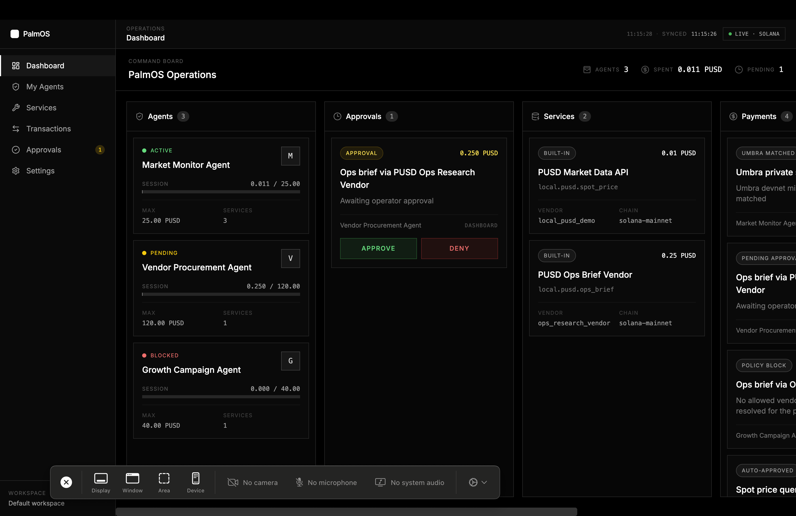

# PalmOS

> Give AI agents wallets, not blank checks.

PalmOS is a payment control plane for external AI agents. It lets an operator register an agent payment identity, attach spend rules, approve high-value requests, and keep a full audit trail for every payment.

The agent brain stays outside PalmOS. It can be Claude Code, Codex, a QVAC-compatible agent, or any custom worker. PalmOS handles the payment layer: policy, wallets, approvals, settlement, and audit.

## Demo Links

- Frontend: https://www.getpalmos.xyz
- API: https://api.getpalmos.xyz

## Core Flow

1. Register an external agent in PalmOS.
2. Choose allowed paid services and settlement mode.
3. Copy the agent SDK credential.
4. Use that credential from Claude Code, Codex, or another agent runtime.
5. PalmOS decides whether each payment is auto-approved, approval-gated, blocked, or privately settled through Umbra.

## Using PalmOS In Claude Code

PalmOS includes Claude Code command guides in `.claude/commands`.

Standard governed PUSD payment:

```text
/palmos-pay palmos.intel.onchain_flow
```

Approval-gated PUSD payment:

```text
/palmos-pay palmos.research.defi_risk
```

Private Umbra settlement:

```text
/palmos-private-pay --agent <agent-id> --amount 0.001 --token wSOL
```

The slash command runs the PalmOS CLI, reports the result, and points back to the dashboard transaction or approval page. The agent never receives wallet private keys.

## PUSD Settlement

PUSD is the main settlement asset for PalmOS paid-service calls. In the demo, agents can pay for market data, risk reports, and vendor services in Palm USD while PalmOS enforces:

- per-call spend limits,
- session budgets,
- service allowlists,
- approval thresholds,
- real Solana settlement readiness checks,
- transaction and policy audit records.

Official PUSD Solana mint:

```text
CZzgUBvxaMLwMhVSLgqJn3npmxoTo6nzMNQPAnwtHF3s
```

Mainnet PUSD test transactions:

- https://solscan.io/tx/5itX5DDUrdof1p5stCWSSRGxvMHRLsq8VaqAxK3PNgUxfNwuG8TKxcYjzWd5juqmRYmRdpzsUVM1CnNLUehfhRUq
- https://solscan.io/tx/5FjDMYLin76qtdLtiLSWcfCNFabWrxem4pLGDhb8R25MXS6MJxd9shXcRXgghU1KJdpTg8sEZkciqGCmovY3dw1P
- https://solscan.io/tx/3DbRNEB3p4q3uRHeLC95ATVpHLx7DcGivD9wAs4BCqeh1a6LHhnY56JBn9t3Sp671zSt6a997BGmAWdg6dR42Hbx

## Umbra Private Settlement

Umbra is the second settlement rail built into PalmOS. Agents can execute private on-chain transactions — where the recipient and amount are shielded through the Umbra mixer — while PalmOS enforces the same policy, approval gate, and audit trail as any standard PUSD payment.

The Umbra path does not bypass controls. It extends them:

- policy check and approval gate run before any Umbra execution,
- funds do not move until the operator approves,
- the same paid-call record updates from approval-pending to executed,
- mixer/UTXO proof metadata and reconciliation status are stored in the dashboard,
- the agent never holds private keys for either settlement path.

Umbra devnet proofs:

- https://explorer.solana.com/tx/NoZREanrKA1qTez6A83fF5GrofMVuQB9nUkPmVGZvvTzASsCFMRaP2saPqF3YtzdzAJSQWEKCN2yyvDJrBL3BAK?cluster=devnet
- https://explorer.solana.com/tx/4AVyedVRvQKJbJHukFEQqzDAGvBiX2hNFJuF9xYfWrrBMa1GkDNbTbbBH3Pmd3qFUeQMcoTVjAQpX5HckagetTqJ?cluster=devnet

## Run Locally

Prerequisites:

- Node 22+
- npm

Install dependencies:

```bash
npm install
cd frontend && npm install
```

Create a local env file:

```bash
cp .env.example .env
```

Start the backend:

```bash
npm run dashboard:api
```

Start the frontend:

```bash
cd frontend
npm run dev
```

The local frontend runs on `http://localhost:5173` and talks to the backend on `http://127.0.0.1:4030`.

## Useful Commands

Register an agent from the terminal:

```bash
npm run palmos:init
```

Run an external agent payment:

```bash
PALMOS_API_URL=http://127.0.0.1:4030 \
PALMOS_AGENT_TOKEN=palmos_... \
PALMOS_SERVICE_ID=palmos.intel.onchain_flow \
npm run palmos:external-agent
```

Run an Umbra private settlement proof:

```bash
npm run palmos:private -- --agent <agent-id> --require-existing-agent --amount 0.001 --token wSOL
```

Approve a pending payment:

```bash
npm run approval:pending -- approve <execution-id> --base-dir <workspace-dir>
```

## Verify

```bash
npm run check
npm test
cd frontend && npm run lint && npm run build
```

## Project Structure

- `src/server/dashboardApi.ts` - dashboard and SDK API.
- `src/app/executePaidServiceCall.ts` - policy-gated paid-service execution.
- `src/app/reviewPendingPaidCall.ts` - approval resolution and continuation.
- `src/policies/compileAgentPolicy.ts` - budget, allowlist, trust-tier, and approval logic.
- `src/integrations/pusd/` - PUSD payment, readiness, transfer, and verifier logic.
- `src/integrations/umbra/` - Umbra private settlement proof and approval-gated privacy rail.
- `src/integrations/ows/` - governed wallet support.
- `frontend/` - PalmOS dashboard.
- `packages/agent/` - `@palmos/agent` SDK package skeleton.

More detail:

- [architecture.md](./architecture.md)
- [docs/deployment.md](./docs/deployment.md)
- [docs/umbra-private-workflow.md](./docs/umbra-private-workflow.md)

## Status

PalmOS is built for the Palm USD x Superteam Frontier hackathon track and is under active development. The core payment infrastructure — PUSD settlement, policy enforcement, approval gates, Umbra private rail, and audit trail — is functional and tested against Solana mainnet.
